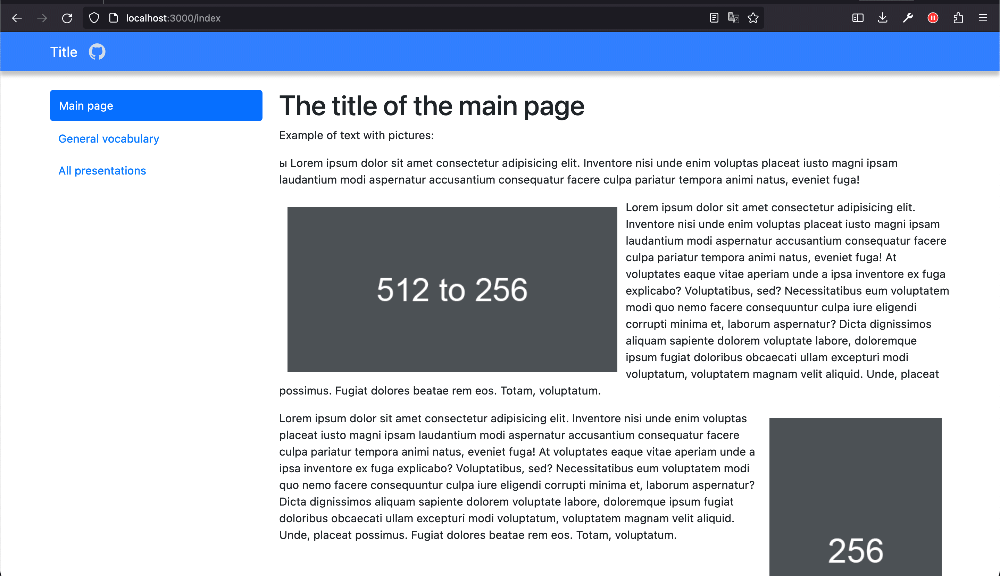

Template\_for\_the\_presentation-dictionary\_website
====================================================

<b>Шаблон для сайта презентации/словаря с серверной частью на Node.js.👇</b>




<hr>

### Инструкция по настройке своей версии сайта:

1.  Загрузите проект и скачайте все зависимости `npm install`
    
2.  Проверьте работоспособность `node server.js`
    
3.  Сконвертируйте все презентации в набор слайдов с расширением .jpeg. Для этого можно воспользоваться скриптом ppt\_to\_jpeg.py
    
4.  1.  Установите Python с официального [сайта](https://www.python.org/downloads/)
        
    1.  Установите: [LibreOffice](https://www.libreoffice.org/download/download/).
        
    2.  Установите Poppler: Poppler(необходим для работы библиотеки pdf2image)
    
    *   Для Windows: скачайте [бинарные файлы Poppler](http://blog.alivate.com.au/poppler-windows/) и добавьте путь к файлам исполнения в переменную среды `Path`.
        
    *   Для macOS: установите с помощью Homebrew: `brew install poppler`
        
    *   Для Ubuntu/Debian: установите с помощью apt: `sudo apt-get install poppler-utils`
        
    
    1.  Установите необходимые библиотеки Python командой `pip install pdf2image`
5.  Переходим в директорию проекта и запускаем код командой `python3 ppt_to_jpeg.py /путь/к/папке/с/презентациями` <br>и получаем папки с набором изображений как в <i>public/media/presentations/</i>
    
6.  Теперь удаляем содержимое папки <i>public/media/presentations/</i> и переносим туда созданные ранее папки со слайдами.
    
7.  В папку <i>public/media/download</i> переносим исходники презентаций (pptx/ppt).
    
8.  Изменяем файл <i>public/baza.json</i> Таким образом:

```json
{   // Главное название (Название папки в ~/presentations)
    "Example_of_a_presentation_0": {
        // Автор презентации
        "author": "akarmain",
        // Категория для фильтра в general_vocabulary
        "category": "rad",
        // Pptx или ppt в зависимости от исходника в ~/download/Главное название
        "extension": "pptx",
        // Общая тема слайдов: номера этих слайдов (для general_vocabulary)
        "number_slides": 3,
        "crumbers_words": {
            "A one rad": [1],
            "A two rad": [1, 2],
            "A three rad": [1, 2, 3]
        }
    }
}
```

Чтобы ускорить процесс создания baza.json, можно воспользоваться скриптом update\_json.js:

1.  Переходим в директорию скрипта.
    
2.  Запускаем код `python3 update_json.py`
    
    *   <b>Введите главное имя</b> <i>(Example\_of\_a\_presentation\_0)</i>
    *   <b>Введите категорию</b> <i>(rad)</i>
    *   <b>Введите количество слайдов</b> <i>(3)</i>
    *   <b>Введите расширение pptx/ppt</b> <i>(pptx)</i>
    *   <b>Введите название слова</b> <i>A one rad</i>
    *   <b>Введите номера слайдов</b> <i>(1)</i>
    *   <b>Введите название слова</b> <i>A two rad</i>
    *   <b>Введите номера слайдов</b> <i>(1 2)</i>
    *   <b>Введите название слова</b> <i>A three rad</i>
    *   <b>Введите номера слайдов</b> <i>(1 2 3)</i>
    *   <b>end</b> (для выхода из ввода crumbers\_words)
    *   <b>end</b> (для полной остановки программы)
3.  Теперь немного изменяем файл baza.json для правильного хранения информации (см. первоначальный пример). И запускаем сайт.
    

### 🚨Внимание

<b>Все названия папок в <i>presentations</i> и презентаций в <i>download</i> должны вместо пробелов содержать "\_".</b>
<b>В <i>baza.json</i> не должно быть повторяющихся элементов. Для проверки запустите checking_duplicate_words.py ("Example" != "Example " используйте пробел для того чтобы сделать эти слова разными)</b> 

### 📇Контакты 
Если у вас возникли трудности или вопросы не стесняйтесь писать мне:
Мой Telegram: [akarmain](https://t.me/akarmain) почта: [andreykarmain@yandex.ru](mailto:andreykarmain@yandex.ru)
